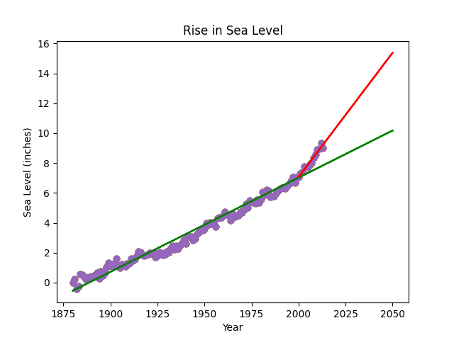

# Sea Level Predictor
The task is to analyze a dataset of the global average sea level change since 1880 and predict the sea level change till year 2050. The project is from ["Data Analysis with Python" course from FCC](https://www.freecodecamp.org/learn/data-analysis-with-python/).

# Data
Sample of dataset:
|  | Year | CSIRO Adjusted Sea Level | Lower Error Bound | Upper Error Bound | NOAA Adjusted Sea Level |
|--| ---: | -----------------------: | ----------------: | ----------------: | -----------------------: |
| 0 | 1880                |  0.000000         | -0.952756          | 0.952756                     | NaN |
| 1 | 1881                |  0.220472         | -0.732283          | 1.173228                     | NaN |
| 2 | 1882                | -0.440945         | -1.346457          | 0.464567                     | NaN |
| 3 | 1883                | -0.232283         | -1.129921          | 0.665354                     | NaN |
| 4 | 1884                |  0.590551         | -0.283465          | 1.464567                     | NaN |

# What the app does
* Draws a scatter plot of sea level data,
* Calculates a linear regression slope and y-intercept using all the data,
* Draws a trend line on top of scatter plot till 2050,
* Calculates a linear regression slope and y-intercept from 2000,
* Draws a trend line on top of two other plots till 2050.

# Results
A green trend line shows sea level which may rich 10 inches over the first measurement if we use all the data. A red line predicts 15 inches if we use the data for only last 20 years. We don't have older data so it's hard to say where the sea level goes next. Measurements for the last 150 years may convince us that all populated world may go under water soon, but we should look at it skeptically.

